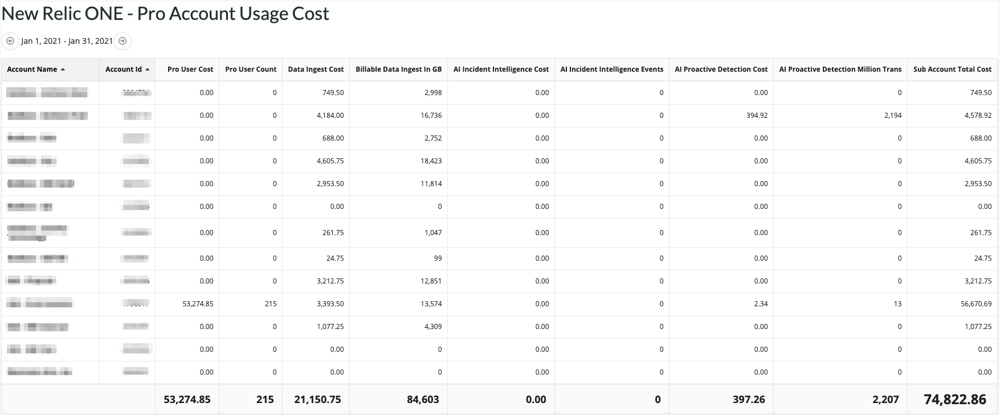

# New Relic One Account Usage Cost for Pro Pricing only (nr1-account-usage-cost)

  

This nerdlet is designed to show the monthly NR1 Pro License costs for a master account and any sub-accounts. It breaks down the cost for number of Full Stack Users (FSO), Data Ingest costs, AI's Proactive Detection and Incident Intellegence costs.

## Features

* Costs are configurable (to reflect discounts) via a Json config file (see `Configuration` below)
* Shows current and previous months cost usages
* Shows cost and billable usage units

## Installation

 - Download repo
 - run `npm install` 
 - run `nr1 nerdpack:uuid -gf`
 - update [config.js](/src/config/settings.json) as needed (see `Configuration` below)
 - Serve locally with `nr1 nerdpack:serve` or [deploy](https://developer.newrelic.com/build-tools/new-relic-one-applications/publish-deploy) to your New Relic account using the `nr1` CLI.

## Configuration
Currently, app-specific configuration is hardcoded into the `/src/config/srttings.json` script, and changes will need to be made in this file at the moment. The following cofiguration attributes are available:

### masterAccount
(*mandatory*) The master account number of the customer's account must be specified here. If the master account is not found, then a critical toast message will be displayed.

### proUserUnitCost
For Professional License accounts, this is the unit cost per FSO user per month. 

### bytesIngestedUnitCost
For Professional License accounts, this is the cost for each GB ingested for telemetry data. The first 100GB are free.

### aiIncidentIntelligenceUnitCost
For Professional License accounts, this is the unit cost for each Incident Intelligence event. The first 1000 events are free. 

### aiProactiveDetectionUnitCost
For Professional License accounts, this is the unit cost per million of the application transactions associated with applications using Proactive Detection. The first 100 million transactions are free. 
